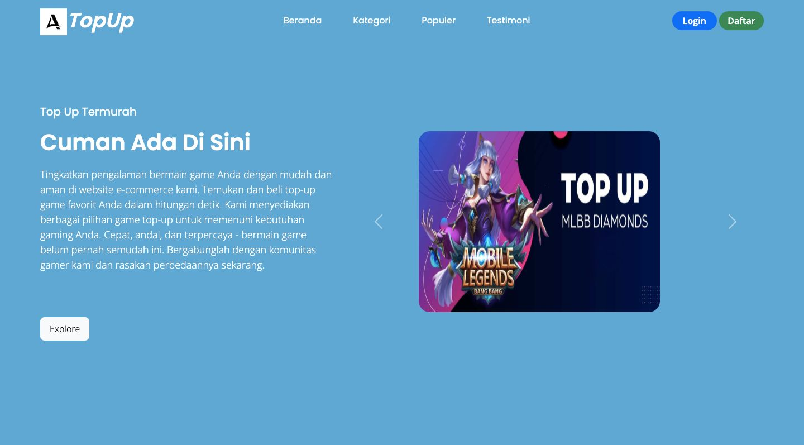
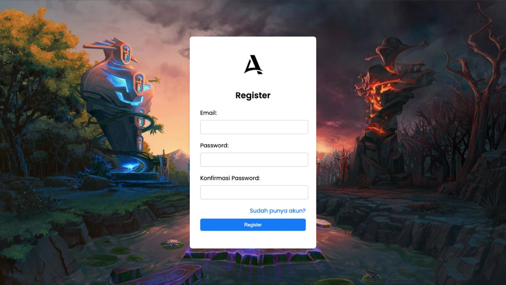
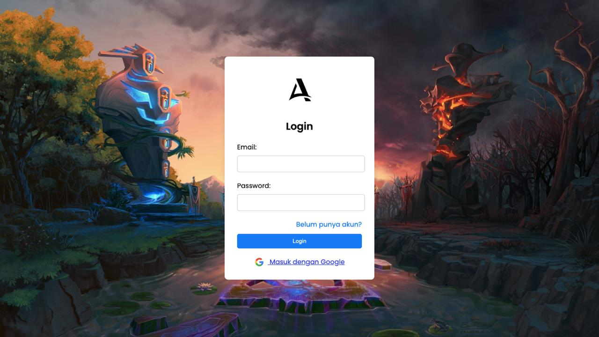
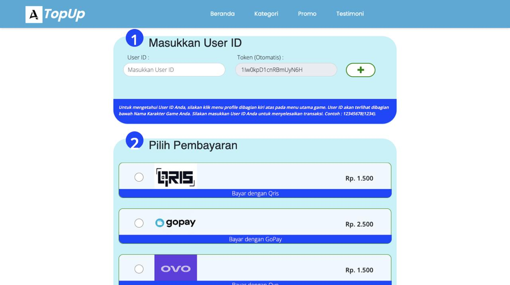

# Adityyy Store - Web Top-Up Game

Website sederhana untuk pembelian top-up game, dibuat sebagai proyek kelompok yang menguji aplikasi menggunakan metode:
- Black Box
- White Box
- Grey Box

## 👨‍💻 Developer
- Frontend Developer & GitHub: [Muhamad Aditya Suhendar]
- Tester: [Trisna Prawijaya,Aji Nata Sobari,Haekal Abdullah Ali Akbar Fajar Ramadhan]

## Fitur
- Register & Login
- Halaman utama dengan promosi top-up game
- Form ID pemain & metode pembayaran
- Keranjang pembelian
- Validasi input form
- Responsif dan modern design

## Pengujian

### Black Box Testing
Dilakukan oleh: [Trisna Prawijaya]  
Contoh test case:
- Input kosong pada form register
- Email tidak valid pada login
- Password tidak cocok saat register

### White Box Testing
Dilakukan oleh: [Aji Nata Sobari]  
Cakupan:

Skenario Uji White Box

• Desk Checking

• Code Walkthrough

• Formal Inspection

• Control Flow Testing

• Data Flow Testing

• Basic Path Testing

• Loop Testing

### Grey Box Testing
Dilakukan oleh: [Haekal Abdullah Ali Akbar Fajar Ramadhan]  
Metode:
- Gabungkan pengujian UI + logika kode
- Cek interaksi ID Game & metode pembayaran (cart.html)
- Validasi hasil DOM manipulation

## Cara Menjalankan
Buka `index.html` di browser

## Tampilan Aplikasi

### Halaman Dashboard

### Halaman Register

### Halaman Login

### Halaman Keranjang (Cart)

