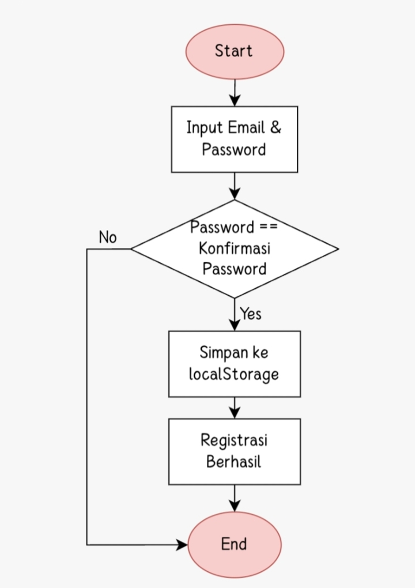
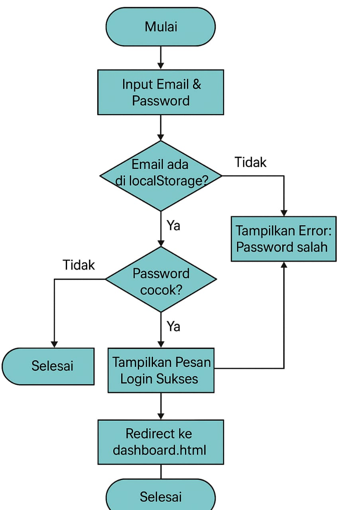

# White box test Adityyy Store

## Tujuan
• Cek struktur fungsi register() dan login() di auth.js

• Di kedua file (register.html dan login.html), terdapat pemanggilan fungsi:
1. register() saat submit form register
2. login() saat submit form login

• Artinya, fungsi register() dan login() berada di file auth.js
Untuk white box testing, Anda perlu menganalisis isi dari dua fungsi ini:

• Apakah fungsi melakukan validasi input?

• Apakah ada pengondisian dan pengulangan yang signifikan?

• Apakah ada error handling?

### Fungsi `register()` di auth.js
Fungsi untuk registrasi pengguna baru.
• Mengambil input email, password, dan konfirmasi password.

• Menampilkan loading popup dengan SweetAlert.

• Mengecek apakah email sudah terdaftar:

• Jika sudah, tampilkan pesan error dan arahkan kembali ke register.html.

• Jika belum terdaftar:
Periksa apakah password dan konfirmasi cocok.

• Jika tidak cocok, tampilkan pesan error.

• Jika cocok, simpan data pengguna baru ke localStorage, dan tampilkan pesan sukses.

### Fungsi `login()` di auth.js
Fungsi untuk memproses login pengguna.
• Mengambil daftar user dari localStorage.

• Memeriksa apakah input email dan password cocok dengan salah satu pengguna.

• Jika cocok:
Simpan data pengguna yang login ke loginUsers di localStorage.
Tampilkan pesan sukses menggunakan SweetAlert dan arahkan ke index.html.

• Jika tidak cocok:
Tampilkan pesan error dan arahkan kembali ke login.html.

### Flowchart
• Registrasi

• Login

### Coverage
• Test Case

🔐 createAdminUser()

| No | Skenario             | Data Awal               | Hasil yang Diharapkan       | Status |
|----|----------------------|--------------------------|------------------------------|--------|
| 1  | localStorage kosong  | Tidak ada item 'users'   | Admin ditambahkan           | ✅     |
| 2  | Admin sudah ada      | Sudah ada admin@gmail.com| Tidak ditambahkan ulang     | ✅     |

---

🔑 login()

| No | Skenario                      | Input Email         | Input Password | Data User Tersimpan             | Hasil yang Diharapkan               | Status |
|----|-------------------------------|----------------------|----------------|----------------------------------|-------------------------------------|--------|
| 1  | Login berhasil                | admin@gmail.com      | 11111          | Admin sudah di localStorage      | Popup sukses, redirect ke index.html| ✅     |
| 2  | Email benar, password salah   | admin@gmail.com      | salah          | Admin sudah di localStorage      | Popup gagal, redirect ke login.html | ✅     |
| 3  | Email tidak terdaftar         | tidakada@gmail.com   | bebas          | Tidak ada user dengan email tsb  | Popup gagal, redirect ke login.html | ✅     |
| 4  | Input kosong                  | *(kosong)*           | *(kosong)*     | Ada data user                    | Popup gagal, redirect ke login.html | ✅     |

---

📝 register()

| No | Skenario                                 | Input Email        | Password     | Konfirmasi Password | Data Awal                   | Hasil yang Diharapkan                                      | Status |
|----|------------------------------------------|--------------------|--------------|----------------------|------------------------------|------------------------------------------------------------|--------|
| 1  | Email belum terdaftar, password cocok    | user1@gmail.com    | pass123      | pass123              | Kosong atau email lain       | User ditambahkan, popup sukses, redirect ke login.html     | ✅     |
| 2  | Email sudah terdaftar                    | admin@gmail.com    | pass123      | pass123              | Sudah ada admin              | Popup error, redirect ke register.html                     | ✅     |
| 3  | Password dan konfirmasi tidak cocok      | user2@gmail.com    | pass123      | beda123              | Email belum ada              | Popup error, redirect ke register.html                     | ✅     |
| 4  | Input kosong                             | *(kosong)*         | *(kosong)*   | *(kosong)*           | Kosong                       | Gagal daftar (popup error), redirect ke register.html      | ✅     |

---

🪄 window.onload

| No | Skenario                        | Halaman Dimuat       | Data Awal di users   | Hasil yang Diharapkan               | Status |
|----|--------------------------------|------------------------|-----------------------|-------------------------------------|--------|
| 1  | Halaman login/register dibuka  | window.onload aktif    | Tidak ada admin       | Admin otomatis ditambahkan          | ✅     |
| 2  | Admin sudah ada                | window.onload aktif    | Sudah ada admin       | Tidak mengubah isi localStorage     | ✅     |

[Pdf Test Case](laporan-test/Laporan_Bukti_Pengujian_authjs.pdf)
