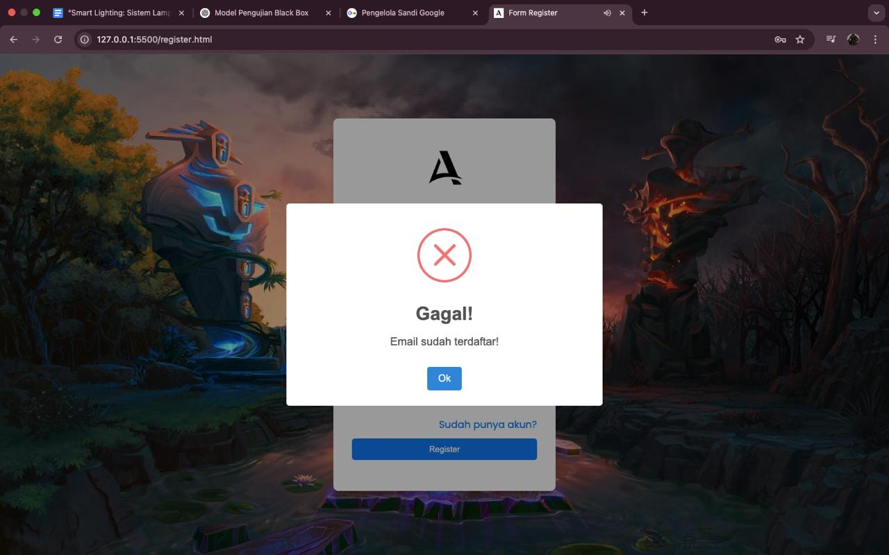
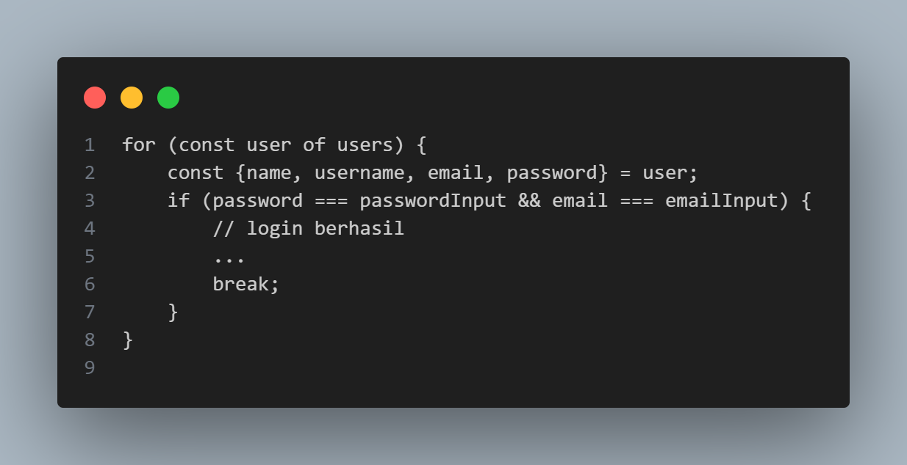

# WHITE-BOX TESTING
## Skenario Uji White Box (auth.js)

### Desk Checking

- Baca kode per baris untuk pastikan logika benar dan semua jalur masuk akal.

- Contoh temuan: login tidak valid langsung diarahkan kembali ke halaman login.

### Code Walkthrough

Fungsi createAdminUser()

 - Membuat akun admin default jika belum ada.

- Aman digunakan, meskipun bisa dipertimbangkan untuk menghindari hardcode password.

Fungsi login()

- Mencari user yang cocok berdasarkan email dan password.

- Menghapus data login sebelumnya dan menyimpan user yang berhasil login.

 Catatan:

- Tidak ada validasi format email (misalnya dengan regex).

- Email dan password dicek dengan === tanpa sanitasi input.

Fungsi register()

- Memeriksa email sudah terdaftar.

- Memvalidasi kesesuaian password dan konfirmasi.

- Jika berhasil, menambahkan user baru.

Catatan:

- Nama dan username diisi sama dengan email.

- Validasi kekuatan password (seperti panjang minimal) tidak ada.

### Formal Inspection

Input/output dan format validasi:

- Input: email, password, konfirmasi password.

- Output: SweetAlert untuk hasil sukses/gagal.

Catatan:

- Belum ada validasi karakter email atau panjang password.

- Tidak ada feedback langsung di form (semuanya melalui alert).

Screenshot

- Halaman Login

- Halaman Registrasi

- Login Berhasil

- Login Gagal

- Daftar Berhasil

- Daftar Gagal (Email Terdaftar)

- Daftar Gagal (Konfirmasi Password Tidak Cocok)

### Control Flow Testing

| No | Fungsi    | Kondisi                                                      | Cabang Logika yang Diuji                         | Hasil |
|----|-----------|--------------------------------------------------------------|--------------------------------------------------|--------|
| 1  | login     | Email dan password cocok                                     | user ditemukan → alert sukses → redirect index  | Sukses |
| 2  | login     | Email cocok, password salah                                  | user tidak ditemukan → alert gagal → login.html | Sukses |
| 3  | login     | Email tidak ditemukan                                        | user tidak ditemukan → alert gagal → login.html | Sukses |
| 4  | register  | Email sudah terdaftar                                        | tampilkan alert error email                     | Sukses |
| 5  | register  | Password dan konfirmasi tidak cocok                          | tampilkan alert error password mismatch         | Sukses |
| 6  | register  | Email baru, password cocok                                   | simpan user → alert sukses → redirect login     | Sukses |

### Data Flow Testing

| No | Variabel             | Lokasi Deklarasi      | Lokasi Penggunaan          | Status    | Catatan                                  |
|----|----------------------|------------------------|-----------------------------|-----------|------------------------------------------|
| 1  | emailInput           | login(), register()    | Kondisi pencocokan email    | Digunakan | Input dari user                         |
| 2  | passwordInput        | login(), register()    | Pengecekan dan penyimpanan  | Digunakan | Tidak dienkripsi                        |
| 3  | passwordKonfirmasi   | register()             | Validasi kesamaan password  | Digunakan | Validasi eksplisit                      |
| 4  | users                | Semua fungsi           | Dicari, dimodifikasi        | Digunakan | Disimpan di localStorage                |
| 5  | userFound            | login()                | Pengecekan hasil pencarian  | Digunakan | Nilai boolean                          |
| 6  | emailUserExists      | register()             | Validasi eksistensi email   | Digunakan | Dihasilkan dari some()                  |

- Flowchart

 
### Basic Path Testing

Cyclomatic Complexity
- Rumus:
  -V(G) = E - N + 2P
  
  - N = jumlah node (keputusan & aksi)
  
  - P = jumlah komponen terhubung (biasanya 1 untuk satu fungsi)

Fungsi login()

Keputusan (if):

- if (password === passwordInput && email === emailInput)

- if (result.isConfirmed) → (dalam swal sukses)

- if (!userFound)

- if (result.isConfirmed) → (dalam swal gagal)

Total node keputusan: 4
Estimasi node total: ~8
Estimasi edge: ~9–10
Komponen terhubung (P): 1

V(G) = 10 - 8 + 2(1) = 4

Test Case – Fungsi login()

| TC ID | Nama Skenario                        | Input                        | Kondisi                            | Expected Output                           |
|-------|--------------------------------------|------------------------------|-------------------------------------|--------------------------------------------|
| TC-L1 | Login berhasil                       | Email terdaftar, password benar | user ditemukan                      | Alert sukses, redirect ke index.html       |
| TC-L2 | Login gagal – email tidak ditemukan  | Email tidak terdaftar         | user tidak ditemukan                | Alert gagal, redirect ke login.html        |
| TC-L3 | Login gagal – password salah         | Email benar, password salah   | user tidak ditemukan (password mismatch) | Alert gagal, redirect ke login.html  |
| TC-L4 | Login – users kosong                 | Tidak ada user di localStorage| loop tidak jalan                    | Alert gagal, redirect ke login.html        |

Fungsi register()

Keputusan (if):

1. if (emailUserExists)

2. if (result.isConfirmed) → swal error 1

3. if (passwordInput !== passwordKonfirmasiInput)

4. if (result.isConfirmed) → swal error 2

5. if (result.isConfirmed) → swal sukses

Total node keputusan: 5
Estimasi node total: ~10
Estimasi edge: ~12
Komponen terhubung (P): 1

V(G) = 12 - 10 + 2(1) = 4

Test Case - Fungsi register()

| TC ID | Nama Skenario                        | Input                          | Kondisi                            | Expected Output                           |
|-------|--------------------------------------|--------------------------------|-------------------------------------|--------------------------------------------|
| TC-R1 | Register gagal – email sudah ada     | Email terdaftar, password cocok | emailUserExists = true             | Alert error: email sudah digunakan         |
| TC-R2 | Register gagal – password tidak cocok| Email baru, password mismatch   | emailUserExists = false, password mismatch | Alert error: konfirmasi tidak cocok   |
| TC-R3 | Register berhasil                    | Email baru, password cocok      | emailUserExists = false, password match | Alert sukses, redirect ke login.html |
| TC-R4 | Register – localStorage kosong       | Email pertama, password cocok   | users = null                        | Buat array users baru, simpan, alert sukses|

### Loop Testing

Struktur Loop Testing yang diuji

- Login

- Skenario Uji Loop

| No | Kondisi Jumlah Data            | Deskripsi Skenario                      | Diharapkan                                                  |
| -- | ------------------------------ | --------------------------------------- | ----------------------------------------------------------- |
| 1  | 0 user                         | `users = []`                            | Loop tidak dieksekusi sama sekali. Langsung ke login gagal. |
| 2  | 1 user (cocok)                 | `users = [{email: X, password: Y}]`     | Loop jalan 1x, login berhasil, berhenti dengan `break`.     |
| 3  | 1 user (tidak cocok)           | Data tidak cocok                        | Loop jalan 1x, login gagal.                                 |
| 4  | >1 user (cocok di awal)        | User cocok di indeks 0                  | Loop berhenti di iterasi pertama. Login berhasil.           |
| 5  | >1 user (cocok di tengah)      | User cocok di tengah (misal index ke-2) | Loop jalan sampai cocok, login berhasil, lalu `break`.      |
| 6  | >1 user (tidak ada yang cocok) | Semua data salah                        | Loop jalan semua elemen, login gagal.                       |

Hasil Analisis
- Loop tidak berisiko infinite loop, karena iterasi bersifat deterministik (for-of terhadap array).

- Penggunaan break saat login berhasil membuat eksekusi efisien.

- Semua skenario di atas bisa ditangani oleh fungsi dengan benar.

- Tidak ada loop bersarang atau kompleks

Rangkuman Loop Testing

Aspek	Status

Infinite Loop Dicegah	✅ Ya

Semua Skenario Teruji	✅ Ya

Efisiensi (pakai break)	✅ Optimal

Loop Bersih & Tidak Redundan	✅ Benar

- Registrasi

Catatan Teknis

users.some(...) menggunakan loop internal untuk mencari kecocokan:

Berhenti saat menemukan elemen pertama yang cocok.

Jika tidak ditemukan, lanjut hingga akhir array.

Aman dari infinite loop.

- Skenario Uji Loop

| No | Jumlah User                     | Deskripsi Kondisi                   | Diharapkan                                                    |
| -- | ------------------------------- | ----------------------------------- | ------------------------------------------------------------- |
| 1  | 0 user                          | Tidak ada data user                 | `some()` return `false`. Proses lanjut ke validasi password.  |
| 2  | 1 user (cocok)                  | Satu user dan email sudah terdaftar | `some()` return `true`. Muncul alert “Email sudah terdaftar”. |
| 3  | 1 user (tidak cocok)            | Satu user tapi email beda           | `some()` return `false`. Lanjut ke validasi password.         |
| 4  | >1 user (cocok di awal)         | Email cocok pada index 0            | `some()` return `true`. Proses berhenti langsung.             |
| 5  | >1 user (cocok di tengah/akhir) | Email cocok di tengah/akhir         | `some()` scan hingga menemukan, lalu berhenti.                |
| 6  | >1 user (tidak cocok semua)     | Semua email berbeda dengan input    | `some()` scan seluruh array. Return `false`.                  |

Hasil Analisis

- Fungsi some() berperilaku seperti loop singkat (short-circuiting).

- Tidak berisiko infinite loop.

- Efisien karena berhenti saat kondisi terpenuhi.

- Semua jalur dapat diuji melalui jumlah user dan posisi email.

Rangkuman Loop Testing Fungsi register()

Aspek	Status

Infinite Loop Dicegah	✅ Ya

Semua Skenario Teruji	✅ Ya

Efisiensi	✅ Optimal

Struktur Loop Aman	✅ Ya
